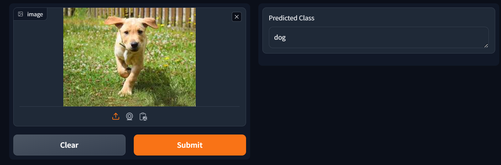
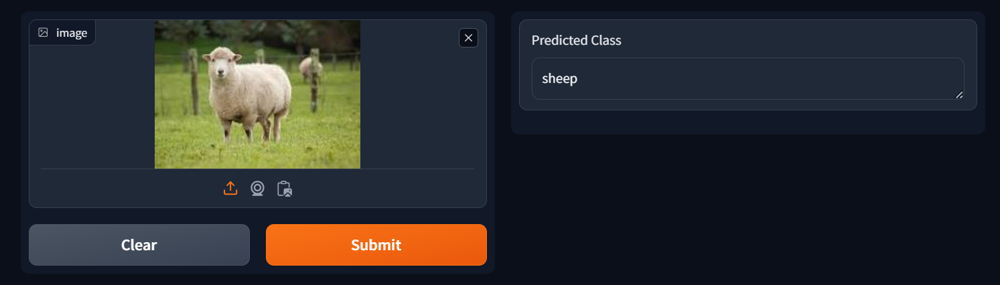
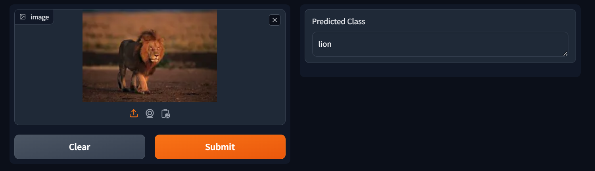

# 🖼️ Image Classification Using CNN 🖼️  

This project utilizes a **Convolutional Neural Network (CNN)** to classify images into four categories:  
🐶 **Dog** | 🐑 **Sheep** | 🦁 **Lion** | 🐐 **Goat**  

You can upload an image through a **Gradio interface**, and the model will predict the corresponding class with high accuracy.  

📌 **Dataset Source:** The dataset has been taken from **Roboflow**.  

📌 **Easy to Use:** Simply download the project, keep all files in **one folder**, and run `app.py` to launch the GUI.  

---

## 📂 Project Structure  

Ensure all files are placed within the **same folder** for proper execution.  

- `app.py` → Main file to launch the Gradio interface  
- `model.pth` → Trained CNN model  
- `requirements.txt` → List of dependencies  
- `images/` → Folder containing sample outputs  

---

### Prediction 1 
  

### Prediction 2  
  

### Prediction 3


## ⚙️ Installation and Setup  

### 1️⃣ **Install Dependencies**  
Ensure you have all the required dependencies installed by running:  
```sh
pip install -r requirements.txt
